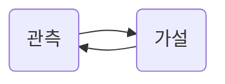
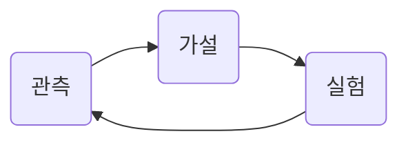

# 데이터를 제대로 사용하려면.

많은 기업에서 데이터 분석을 하는데 

관측하고 가설 세우고 확인하고
다시 관측하고 가설 세우고 ...

**데이터를 실생활에서 의미있게 사용해보자.**

가설에 따른 `action`이 필요하다.

A/B test  같은 **실험(action)** 이 진행되어야 한다.
이 루틴의 끝없는 반복은 불가피하다.
따라서, 루틴의 프로세스를 잘 구축해야한다.

> 프로세스 중요 포인트

1. Data Engineering
	- 로그의 history를 잘 쌓아야 한다.
	- 데이터를 테이블 형식으로 구축한다.
	- SQL을 잘 써먹자.
	- workflow를 잘 구축한다.

2. Data Analysis
	- 심슨 패러독스에서 벗어난다.
	- 분석이 만족스럽지 않다면 충분히 나눠서 생각한다.

> 실험(action)

- "어떤 현상이 당연할꺼 같은데.." 당연한 것은 없음. A/B test로 검증.
- MAB(Multi-Armed Bandit) 알고리즘 이용.

MAB(Multi-Armed Bandit)
: A/B test 단점(1.충분히 테스트안이 쌓이는데 오래걸린다. 2. 테스트되는 동안 효율이 좋지 못한 쪽에 많이 테스트되면 시간, 비용이 허비됨)을 보완하기 위해 사용.

[출처]([https://www.slideshare.net/yongho/ss-52116574](https://www.slideshare.net/yongho/ss-52116574))
